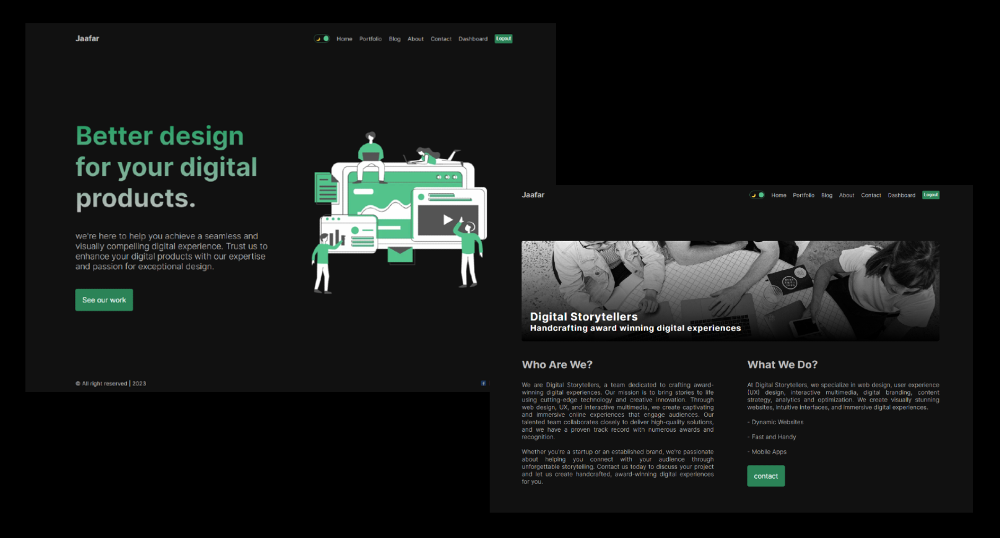
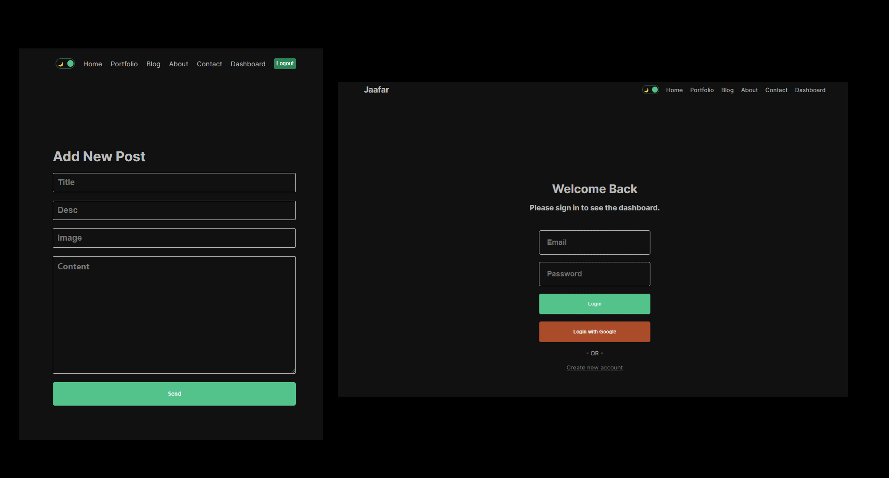
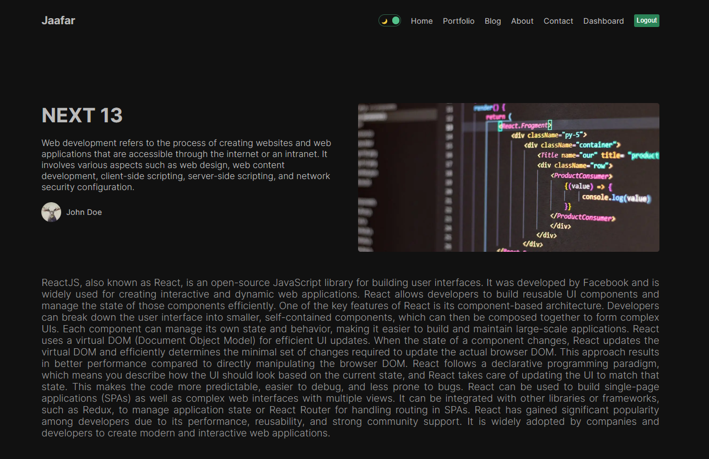

# Next.js-13-Full-Stack-App
Next.js13 Full Stack App is a feature-rich web application that allows users to register using email/password or Google account. It enables users to create, publish, and manage their own blogs with various media elements.  

## Welcome!

Thanks for checking out this Application.
## Overview

### Links

- Live Site URL: NOT DEPLOYED YET

## My process

### Built with

- NEXT.Js 13
- css
- next authentication
- mongoDB
- JavaScript
- JSX

## Author

- Linkedin - [@jaafar youssef](https://www.linkedin.com/in/jaafar-youssef-923100249/)

jaafar youssef
